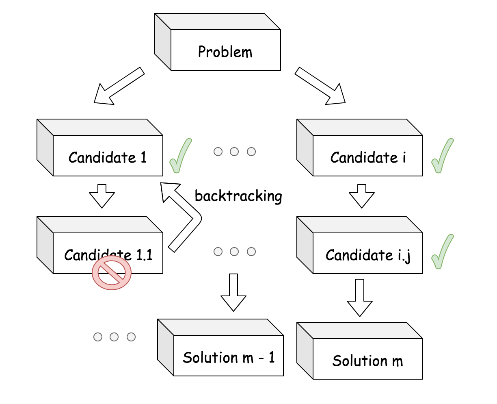

# Backtracking Algorithm
A framework for backtracking algorithm, as an interface and a solving function.

This framework is designed to be used for any backtracking algorithm, and it is not limited to a specific problem.

<p align="center">
  
</p>

You need to implement the (quite simple) interface, and then you can use the solve() function to solve your problem and return all (or one) solutions.

The methods to implement are:
- `get_initial_state()` : returns the initial state of the problem
- `get_valid_action_set(self, state : State)` : returns the set of valid actions from the given state
- `do_action(self, action: Action, state: State)` : returns the new state after doing the given action
- `is_state_solution(self, state: State)` : returns True if the given state is a solution, False otherwise

## Code example

```python
from backtracking import BacktrackingSolver, State, Action
# The 'State' and 'Action' are just aliases for 'Any' type, for more clarity

class MyProblemSolver(BacktrackingSolver):
    def get_initial_state(self) -> State:
        pass
    def get_valid_action_set(self, state : State) -> List[Action]:
        pass
    def do_action(self, action: Action, state: State) -> State:
        pass
    def is_state_solution(self, state: State) -> bool:
        pass

solver = MyProblemSolver()
solutions = solver.solve()

print("Found", len(solutions), "solutions:")
for solution in solutions:
    print(solution)
```


## Example : N-Queens Problem

An example of the N-Queens problem is provided in the `examples\n_queens.py` file.

The N-Queens problem is a classic problem in which you have to place N queens on a NxN chessboard, such that no queen can attack another queen.

To run it :
```bash
python examples\n_queens.py
```
